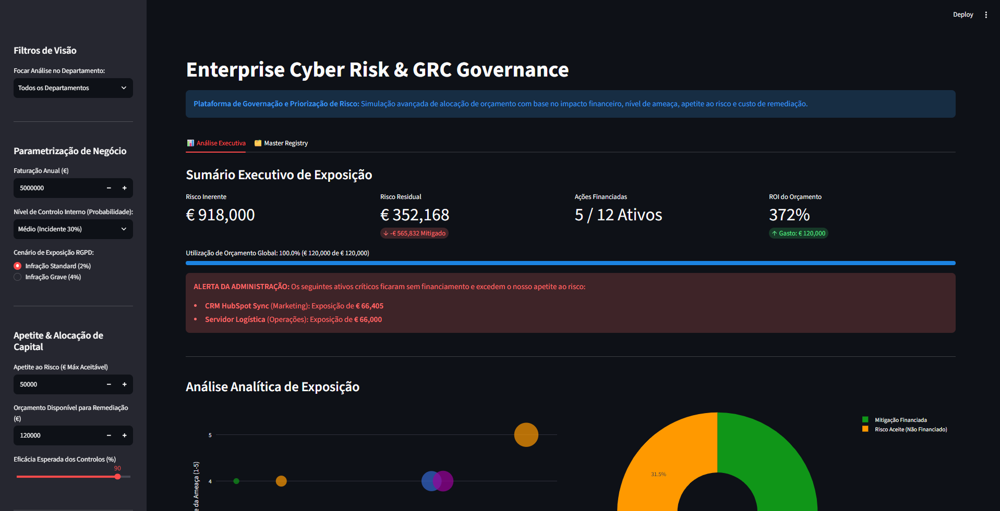
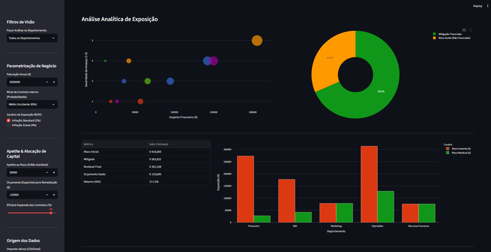

# Enterprise Cyber Risk & GRC Governance Dashboard 🛡️📊


An interactive **Governance, Risk & Compliance (GRC)** platform that translates technical cybersecurity vulnerabilities into executive, financial language.

This simulator lets the board visualize risk exposure, manage the organization's risk appetite, and optimize security budget allocation based on **Return on Investment (ROI)**.



## Key Features

- **Financial Risk Quantification:** Monetized impact assessment of corporate vulnerabilities, automatically incorporating the weight of regulatory fines (e.g., GDPR at 2% or 4% of annual revenue).
- **Budget Optimization (0/1 Knapsack):** A mathematical engine that algorithmically prioritizes which issues to fix first. It maximizes risk reduction under a hard budget constraint, guaranteeing the best possible ROI.
- **Editable Dynamic Master Registry:** Central compliance register (ISO 27001, NIST, PCI-DSS) where users can add, edit or remove assets. Every change recalculates all KPIs and fund allocation in real time.
- **Prevention & Data Quality Mechanisms:** Input validation (e.g., assets with null value or no department assigned) and executive alerts when an unfunded asset exceeds the defined risk appetite limit.



## Modular Software Architecture

The project follows sound software engineering practices, separating business logic from the graphical interface (Separation of Concerns):

- **`app.py`:** UI orchestration, session state and interactive visualizations with Streamlit and Plotly.
- **`motor_risco.py`:** The analytical core. Handles the math, proportional GDPR fine allocation and the 0/1 Knapsack optimization algorithm.
- **`gestor_dados.py`:** Raw data handling. Manages file import (CSV/Excel), column aliases, input normalization and safeguards against data-entry errors.

## 🛠️ Quick Start (Local)

```bash
python -m venv .venv
# Windows: .venv\Scripts\activate    |    Linux/macOS: source .venv/bin/activate
pip install -r requirements.txt
python -m streamlit run app.py
```

Your browser will open the dashboard automatically at `http://localhost:8501`.

> 💡 The CSV template downloaded from the sidebar accepts both **English and Portuguese headers** (e.g., `asset_name`/`Ativo`, `department`/`Departamento`).

## 🐳 Quick Start (Docker)

No local Python required — one command:

```bash
docker compose up --build
```

Or with plain Docker:

```bash
docker build -t grc-dashboard .
docker run -p 8501:8501 grc-dashboard
```

Open `http://localhost:8501`.

## ✅ Running the Tests

```bash
pip install -r requirements-dev.txt
pytest -q
```

Three suites cover the engine math, data management (upload/aliases/editor sync) and end-to-end UI flows via Streamlit's `AppTest`. The same tests run automatically in CI (GitHub Actions) on every push.

## 📋 Export & Audit

After the investment simulation, the full updated risk register (with strategic decisions and calculated residual risk) can be exported as CSV — governance evidence for audit teams (e.g., ISO 27001, SOC 2).

---
